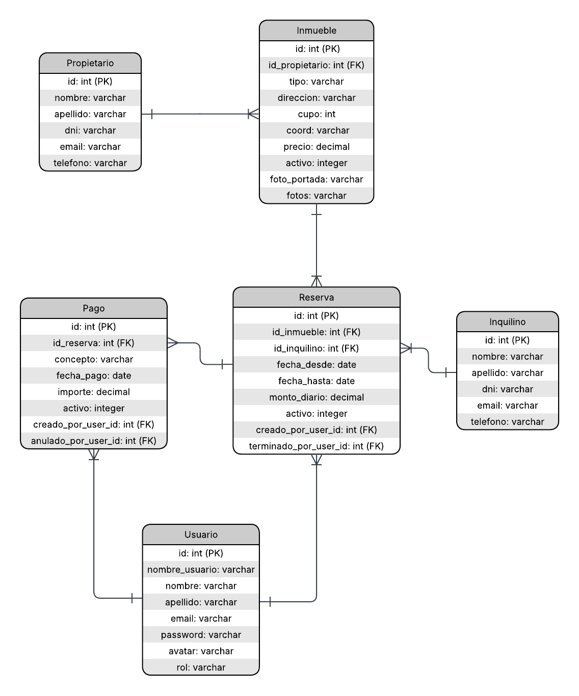

# Proyecto Inmobiliaria

Sistema web para la gestión de alquileres temporarios de una inmobiliaria.

## Integrantes

- Lourdes Villegas - villegasmarialuly@gmail.com - https://github.com/Luly-bitcoin
- Milena Miselli - milivicmp@gmail.com - https://github.com/milemise

## Tecnologías

- ASP.NET MVC
- C#
- Entity Framework / ADO.NET
- MySQL / SQL Server
- HTML
- CSS
- Bootstrap

## Modelado de Datos

## Base de Datos

### Crear la base de datos

1. Abrir el gestor de base de datos.
2. Ejecutar el archivo `alquileres_temporarios.sql`.
3. Verificar que se haya creado la base de datos.
4. Configurar la cadena de conexión del proyecto.

## Ejecución

1. Clonar el repositorio.
2. Abrir la solución en Visual Studio.
3. Restaurar las dependencias.
4. Configurar la conexión a la base de datos.
5. Ejecutar el proyecto.

## Primera entrega

- ABM de Propietarios
- ABM de Inquilinos
